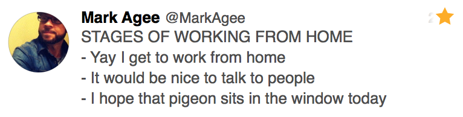

I’m just about to finish my second month working remotely and to be honest, although the majority of it is great, it has some negative aspects too.  

### The 5 Second Commute
Being able to get out of bed and be in the office in less that 5 seconds has me sleeping in more often than not. It’s just too easy to hit the snooze button and I feel like my day gets off to a bad start every time it happens.

Before working remotely, when I had to rise early, it was great. It allowed me to get into a really good routine—the best I’ve ever had. For the first few months of the year I was getting up ~06:30 and hitting the gym before starting my work day and I felt mentally and physically wonderful. When I get up at 08:30 and start work at 09:00, it takes my brain a good 30 minutes before it kicks fully into “work mode”. Last week I woke up at 08:45 and had a pretty awful day because of it.

It’s also very easy to not exercise at all. It’s easy to move from bed, to desk, to sofa without get any exercise in between. Good thing I started running more the past few weeks after work.

### Forever Alone, Sort of
Although I communicate on a daily basis with my co-workers, it can get a little lonely not actually interacting with other people. I miss the social aspect of being in an office, surrounded by people.

Sometimes I don’t leave the house for days on end. It’s great at first, not having to commute, but you miss getting out and about. I try to combat this by getting out of the house 2-3 times a week and heading to a coffee shop to work, but the convenience of staying at home often wins.

As an introvert, there’s a balancing act of spending time with people and recharging on your own. Working remotely is tipping the scales in a negative way for me. Maybe I should get a dog.

### To Summerise
Working remotely is good, but it can be difficult. I wanted a remote job so I could have the freedom to move around and maybe work in different cities throughout the year—I didn’t want to commit to living somewhere, but I havant taken advantage of that yet. I want to take advantage of this soon and I’m sure I will see the true benefits of working remotely more when I do.
